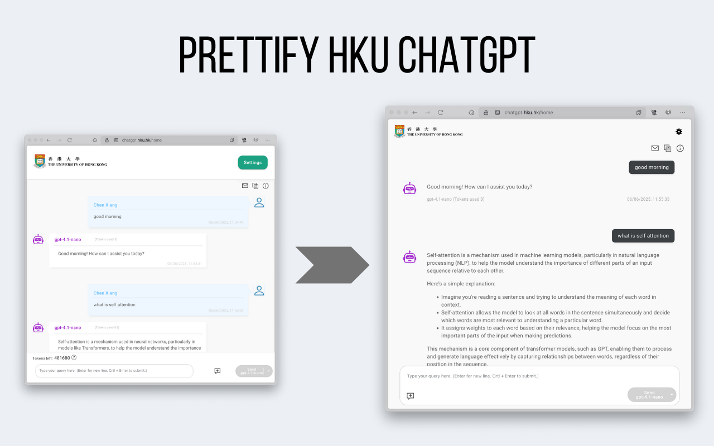

# HKU ChatGPT Prettifier (Browser extension)

This browser extension is designed to prettify the HKU ChatGPT interface, making it more user-friendly and visually appealing.

## Installation
1. Install from chrome or firefox store
2. Enable the extension in the browser's extension settings
3. Reload the HKU ChatGPT page

## TODO
- [ ] Dark mode
- [ ] Better UI for Thinking tokens
- [ ] Better scrolling behaviors
- [ ] Override the ctrl-enter to send behavior (which not work on mac)
* PRs are welcome!
